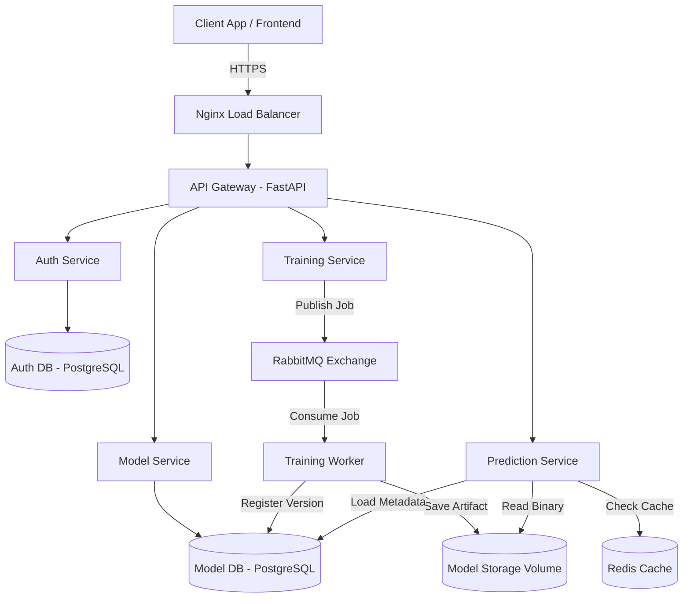
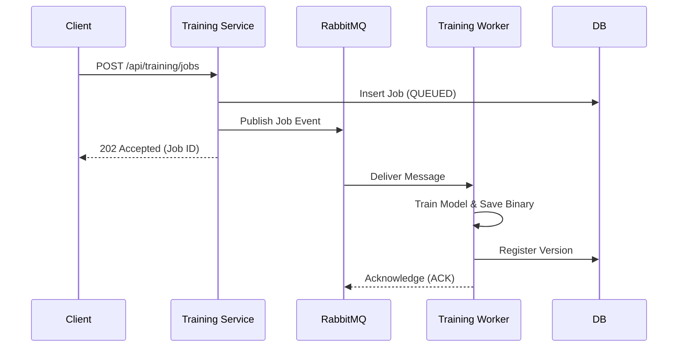

# MLForge

MLForge is a production-grade, locally deployable distributed machine learning platform. It is engineered to demonstrate real-world scalability, microservice architecture, asynchronous messaging, and operational excellence.

## 1. What it is
Traditional ML prototypes are monolithic—training and inference share the same CPU and memory space. A crash during a long-running training job takes down the real-time inference API. 

**MLForge solves this.** It decouples the ecosystem into specialized microservices. Training is pushed to background workers via RabbitMQ, while prediction inference is horizontally scaled behind Nginx and aggressively cached in Redis for sub-millisecond responses. 

## 2. Architecture
*Read the full [Architecture Decision Documentation](docs/architecture.md)*



## 3. Tech Stack
* **Language**: Python 3.12+ (Backend)
* **Framework**: FastAPI (Uvicorn / Pydantic)
* **Databases & Cache**: PostgreSQL, Redis
* **Message Broker**: RabbitMQ
* **Infrastructure**: Docker, Nginx Load Balancer
* **Observability**: Prometheus, Grafana
* **ML Stack**: scikit-learn, joblib

## 4. Core Workflow
*Read the full [Messaging Workflow Documentation](docs/messaging.md)*



## 5. Services
*Read the full [Service Topology Documentation](docs/services.md)*

| Service | Responsibility | Database | Protocol |
| --- | --- | --- | --- |
| **Auth** | User Management & JWTs | `auth_db` | REST |
| **Model** | Version metadata | `model_db` | REST |
| **Training** | Enqueue jobs | `training_db` | REST + AMQP |
| **Worker** | Async ML execution | `training_db` | AMQP + REST |
| **Prediction** | Live inference & caching| `prediction_db`| REST + Redis |
| **Gateway** | Routing & tracing | — | REST |

## 6. Quick Start
*Read the full [Deployment Documentation](docs/deployment.md)*

```bash
# Clone the repository
git clone https://github.com/yourusername/mlforge.git
cd mlforge

# Start the distributed environment
docker compose up --build -d
```
## 7. API Examples
*Read the full [API Reference](docs/api.md) and [Database Schemas](docs/database.md)*

All traffic is routed through the API Gateway at `http://localhost`.
```bash
# Submit an async training job
curl -X POST http://localhost/training/jobs \
     -H "Authorization: Bearer <TOKEN>" \
     -H "Content-Type: application/json" \
     -d '{"model_id": "churn-predictor", "algorithm": "random_forest", "dataset_path": "/data/train.csv"}'
```

## 8. Testing
*Read the full [Testing Strategy Documentation](docs/testing.md)*

MLForge uses a strict testing pyramid ranging from unit tests to automated chaos testing:
```bash
pytest tests/unit/        # Fast business logic assertions
pytest tests/integration/ # Service-to-Database/RabbitMQ integration
pytest tests/e2e/         # Full platform black-box traversal
pytest tests/failure/     # Programmatic 'docker stop' chaos tests
locust -f load-tests/...  # High-concurrency traffic simulation
```

## 9. Observability
*Read the full [Observability Documentation](docs/observability.md)*

Application latency, cache hit ratios, and RabbitMQ dead-letter queues are natively scraped by Prometheus and visualized in real-time via pre-configured Grafana dashboards. All logs are emitted as structured JSON, injected with an `X-Request-ID` by the API Gateway to enable distributed tracing.

## 10. Scalability
*Read the full [Scalability & Load Test Results](docs/scalability.md)*

The Prediction Service is entirely stateless, offloading caching to a shared Redis cluster. Load tests demonstrate that scaling from 1 to 3 Prediction Replicas behind Nginx increases throughput from **~1,500 RPS to >4,200 RPS** while maintaining a strict **sub-100ms p99 latency SLA**.

## 11. Failure Handling
*Read the full [Reliability Documentation](docs/reliability.md) and [Debugging Guide](docs/debugging.md)*

The system is resilient by design:
- **Redis Crash**: Prediction service gracefully degrades to disk/Postgres, maintaining 100% availability.
- **Worker Crash (OOM)**: Unacknowledged jobs are held by RabbitMQ and instantly redelivered to healthy worker replicas.
- **Node Failures**: Nginx automatically reroutes traffic away from dead prediction instances.

## 12. Repository Structure

```text
MLForge/
├── docs/                 # Architectural documentation
├── infrastructure/       # Docker, Nginx, Prometheus, Grafana configs
├── load-tests/           # Locust benchmarking scripts
├── services/             # Microservice source code
│   ├── api-gateway/
│   ├── auth-service/
│   ├── model-service/
│   ├── prediction-service/
│   ├── training-service/
│   └── training-worker/
└── tests/                # Unit, Integration, E2E, and Failure tests
```

## 13. Engineering Highlights
- **Distributed Idempotency**: RabbitMQ workers use PostgreSQL unique constraints to guarantee *exactly-once* processing, preventing duplicate model training during network blips.
- **Circuit Breaking & Retries**: Transient database connection failures utilize exponential backoff strategies to prevent cascading failures.
- **Architectural Decision Records**: Key infrastructure choices are documented and defended against alternatives in the [ADR Log](docs/decisions.md).
