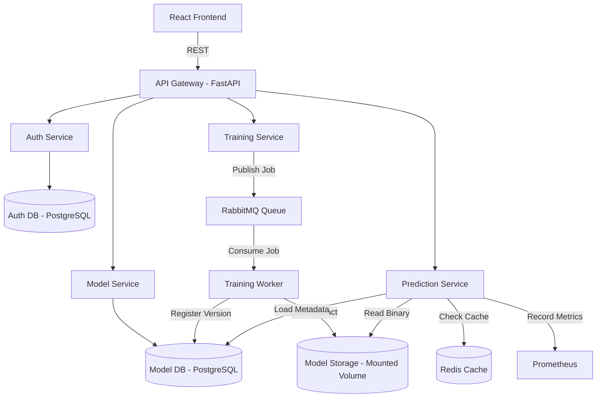

# MLForge: Distributed ML Model Serving & Monitoring Platform

MLForge is a production-grade, locally deployable distributed machine learning platform designed to showcase microservice architecture, asynchronous message queue patterns, fault tolerance, horizontal scaling, and end-to-end system observability.

---

## 1. Project Overview
MLForge is a decoupled system that transitions from a simple, monolithic ML prototype to a scalable distributed system. Rather than focusing on ML model complexity, the project demonstrates real-world software engineering principles, including database idempotency, transient failure retries, load balancing, caching, and containerized deployment.

## 2. Problem Statement
Traditional ML prototypes combine training, inference, data persistence, and model management into a single application. This monolithic approach is:
* Hard to scale independently (e.g., training requires heavy CPU/GPU, while prediction requires low latency and quick turnaround).
* Susceptible to cascade failures (e.g., a memory leak during training crashes the prediction API).
* Difficult to monitor and debug in production.

## 3. Goals
* Provide independent services for Authentication, Model Registry, training job submission, training worker processing, and real-time prediction inference.
* Handle long-running training jobs asynchronously without blocking client HTTP requests.
* Ensure reliability through exponential-backoff retry policies, dead-letter queues, and database idempotency.
* Scale prediction instances horizontally under load.
* Achieve deep system observability using Prometheus metrics and Grafana dashboards.

## 4. Architecture
The architecture comprises a React/Next.js frontend, an API Gateway, several core FastAPI microservices, message queues, caching layers, and relational storage.



## 5. Service Responsibilities
* **API Gateway**: Single entry point routing internal microservice traffic, forwarding authorization, and creating correlation IDs.
* **Auth Service**: User registration, secure password hashing, JWT generation, and identity validation.
* **Model Service**: Metadata persistence, versions tracking, and model activation lifecycles.
* **Training Service**: Asynchronously accepts training requests and enqueues jobs.
* **Training Worker**: Consumes queued training jobs, preprocesses data, trains models, saves binaries, and updates status.
* **Prediction Service**: Serves model inference using Redis caching and falls back gracefully on cache/DB failure.

## 6. Technology Stack
* **Language**: Python 3.12+ (Backend), JavaScript/HTML/CSS (Frontend)
* **Framework**: FastAPI (Uvicorn / Pydantic)
* **ML Libraries**: scikit-learn, pandas, NumPy, joblib
* **Databases & Cache**: PostgreSQL, Redis
* **Message Queue**: RabbitMQ
* **Containerization & Proxy**: Docker, Docker Compose, Nginx
* **Observability**: Prometheus, Grafana, Structured logs
* **Load Testing**: Locust

## 7. Request Flow
1. Client sends request to API Gateway.
2. Gateway generates a unique `request_id` (Correlation ID) and injects it into headers.
3. Gateway forwards request to target microservice.
4. Microservice processes request, logs structured messages containing `request_id`, and returns response.

## 8. Asynchronous Training Flow
1. Client submits training parameters to `POST /api/training/jobs`.
2. Training Service writes a new job to DB as `QUEUED`, publishes a message to RabbitMQ, and immediately returns HTTP 202 `Accepted` with `job_id`.
3. RabbitMQ route directs the event to the Training Worker.
4. Worker sets job status to `RUNNING`, processes dataset, saves model artifact, registers version, sets job status to `COMPLETED`, and acknowledges (ACK) RabbitMQ.

## 9. Database Design
PostgreSQL persists durable application states:
* `users`: Auth credentials and hashes.
* `models`: Core metadata.
* `model_versions`: Linked specific algorithm versions, parameters, and storage paths.
* `training_jobs`: Progress logs and retry trackers.
* `prediction_requests`: Log of inference inputs, results, and latency metrics.
* `processed_events`: Deduplication table using unique `event_id` keys.

## 10. RabbitMQ Design
* **Exchange**: `training.exchange`
* **Queue**: `training.jobs` for active tasks.
* **Dead-Letter Queue (DLQ)**: `training.dead` for persistent failures after retry exhaustion.

## 11. Retry Strategy
* **Maximum Retries**: 3
* **Delay**: Exponential backoff (Attempt 1: immediate, Attempt 2: 2s, Attempt 3: 4s, Attempt 4: 8s).
* **Transient Failures**: Retried (e.g., temporary DB connection failure, network blips).
* **Permanent Failures**: Rejected immediately without retry (e.g., malformed inputs, missing columns).

## 12. Idempotency Strategy
To avoid duplicate training or model registration from redelivered events:
* Every RabbitMQ message contains a unique `event_id`.
* The worker inserts the `event_id` into a `processed_events` database table with a unique constraint.
* If a duplicate insertion violates the unique constraint, the transaction is rejected, and the message is safely acknowledged and discarded without re-processing.

## 13. Fault Tolerance
* **Redis Outage**: The prediction service logs a warning and falls back to loading models directly from storage, degrading gracefully.
* **PostgreSQL Outage**: Readiness checks return unhealthy; service handles failures gracefully with appropriate HTTP 503 response codes.
* **Worker Crash**: RabbitMQ does not receive an ACK, redelivers the message upon worker restart, and the worker recovers the state using idempotency checks.

## 14. Caching Strategy
* **Key Format**: `prediction:{model_version}:{hash(features)}`
* **TTL**: 5 minutes
* **Hit**: Cached result returned immediately, bypassing inference latency.
* **Miss**: Model loads/runs inference, and the result is stored in Redis.

## 15. Scalability
* Prediction service is stateless.
* **Nginx** load balancer acts as a reverse proxy, distributing requests round-robin across multiple scaled prediction service containers.

## 16. Monitoring
* Standard `/metrics` endpoint exposed across services.
* Prometheus scrapes HTTP latencies, throughput, error rates, queue depths, and memory/CPU usage.
* Grafana provides a unified dashboard showing high-level system state.

## 17. CI/CD
* GitHub Actions validates code linting, executes unit and integration tests, builds Docker images, and tags/pushes them to GitHub Container Registry.

## 18. Testing
* **Unit Tests**: Parameter validation, retry calculations, cache key hash generation.
* **Integration Tests**: Service-to-DB connection validation, RabbitMQ publisher-subscriber pipelines.
* **End-to-End Tests**: Complete flow from user registration -> training job -> model loading -> prediction result.

## 19. Failure Scenarios
* Scenarios are verified via automated chaos scripts simulating container stops (`docker stop`) and network latency injection.

## 20. Debugging
Troubleshooting follows a structured checklist:
1. Audit Grafana alert thresholds.
2. Query `/health` and `/ready` endpoints.
3. Grep structured logs using the specific transaction `request_id`.

## 21. Installation
Instructions will be added as deployment scripts are finalized.

## 22. Running Locally
```bash
# Clone the repository
git clone <repository_url>
cd mlforge

# Start the environment
docker compose up --build
```

## 23. API Documentation
Swagger UI documentation is automatically generated by FastAPI and will be accessible at:
* `/docs` (Swagger UI)
* `/redoc` (ReDoc UI)
