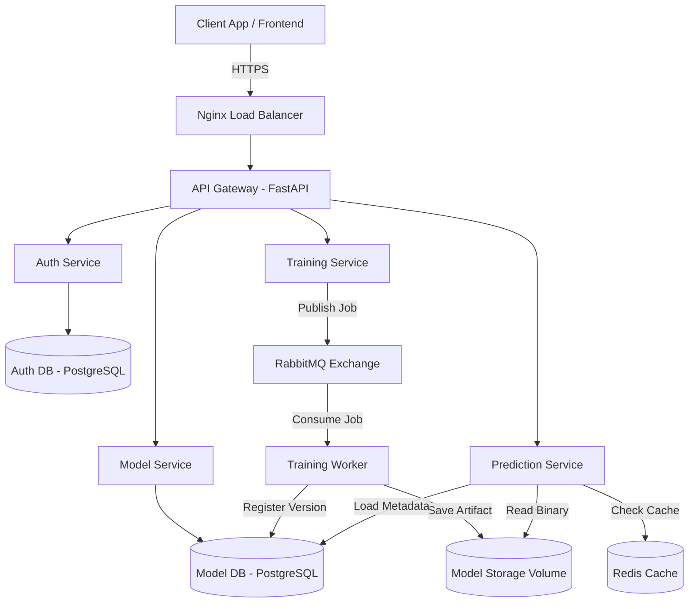

# MLForge Architecture

MLForge is designed as a distributed machine learning platform, transitioning away from monolithic structures to demonstrate real-world scalability and operational excellence. 

This document explains the "Why" behind our technology choices and architectural decisions.

## Architecture Diagram

## Why Microservices?
Traditional ML prototypes combine training, inference, and management into a single application. This monolithic approach is hard to scale because:
- **Resource Contention**: Training requires heavy CPU/GPU computation, while prediction inference requires low-latency, high-throughput I/O.
- **Cascade Failures**: A memory leak during training can easily crash the entire prediction API.
- **Independent Scaling**: Splitting the domains allows us to scale Prediction horizontally while keeping Training constrained to specific worker nodes.

## Why RabbitMQ?
Machine learning training is a long-running process. It should never block an HTTP request. 
- We use RabbitMQ to offload training jobs asynchronously.
- RabbitMQ provides robust delivery guarantees, meaning if a worker crashes mid-training, the unacknowledged message is preserved and redelivered to the next available worker.
- Features like Dead-Letter Queues (DLQ) allow us to cleanly handle poisoned messages (e.g., jobs with permanently un-trainable datasets).

## Why PostgreSQL?
We use PostgreSQL as the persistent source of truth.
- **ACID Compliance**: It ensures transactional integrity when updating model versions or user credentials.
- **Idempotency**: Using `UNIQUE` constraints on event tracking tables, PostgreSQL prevents duplicate job processing in our distributed workers.

## Why Redis?
Machine learning inference can be computationally expensive.
- For identical inputs (which often occur in batch processing or repetitive user queries), we cache the predictions in Redis.
- This allows the prediction service to return sub-millisecond responses without loading the model into memory or running the inference algorithm again.

## Why API Gateway?
The API Gateway acts as the single entry point for all external traffic.
- **Correlation IDs**: It generates an `X-Request-ID` and passes it downstream, making distributed tracing and debugging possible across logs.
- **Unified Surface**: It abstracts the complexity of the microservices away from the client.
- **Centralized Auth**: It can enforce authentication checks before traffic hits internal domains.

## Why Nginx?
While the API Gateway routes API paths, Nginx sits at the very edge of the network.
- **Load Balancing**: Nginx distributes traffic across multiple instances of the Prediction service using Round-Robin (or least connections) algorithms.
- **Fault Detection**: If a Prediction instance goes offline, Nginx detects the failure and transparently reroutes traffic to healthy replicas.

## Why Prometheus and Grafana?
You cannot scale what you cannot measure.
- **Prometheus** scrapes application metrics (HTTP latencies, cache hit ratios, queue depths) efficiently via a pull-based model.
- **Grafana** visualizes these metrics in real-time, providing actionable dashboards to detect anomalous behavior, monitor SLAs, and trigger alerts.
