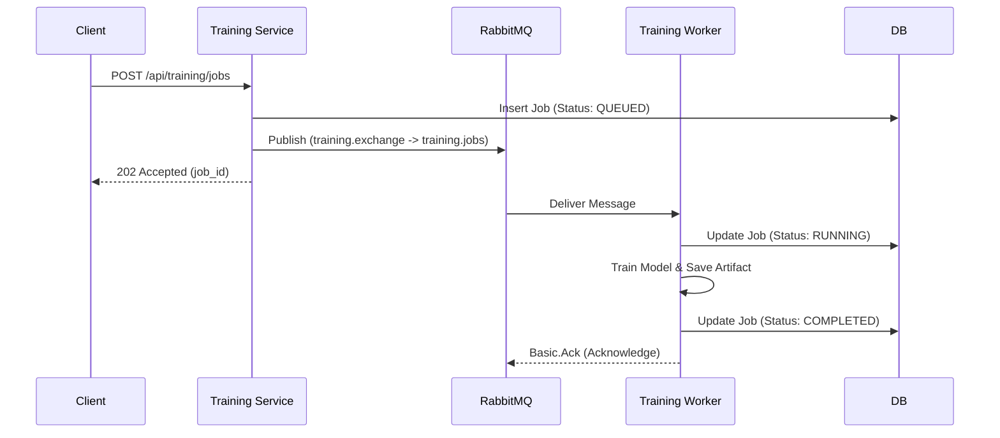

# Asynchronous Messaging (RabbitMQ)

MLForge utilizes RabbitMQ to handle compute-heavy operations asynchronously. This prevents the HTTP API from blocking while models train for extended periods.

## Message Lifecycle Workflow

## Core Messaging Concepts Used

### 1. The Exchange & Routing
Rather than pushing messages directly to a queue, the Training Service publishes to an **Exchange** (`training.exchange`). This exchange routes the message to the `training.jobs` queue using a binding key. This pattern allows us to easily add future consumers (e.g., an audit logger) without changing the producer.

### 2. Idempotency (Exactly-Once Semantics)
Message queues guarantee "at-least-once" delivery, which means a message might be delivered twice (e.g., if a network blip occurs right as the ACK is sent).
- We generate a unique `event_id` (UUID) for every message.
- Before training begins, the Worker attempts to insert this `event_id` into a `processed_events` table in PostgreSQL.
- This table has a `UNIQUE` constraint. If it fails, we know it's a duplicate delivery. The worker safely ACKs the message and ignores it, preventing duplicate training.

### 3. Acknowledgements (ACK / NACK)
Messages are not deleted from RabbitMQ when a worker receives them. They are only deleted when the worker explicitly sends an `ACK` after *successful* completion.
- If the worker container is killed mid-training, the TCP socket drops.
- RabbitMQ detects the drop, knows the message was never ACKed, and immediately redelivers it to the next available worker.

### 4. Dead-Letter Queues (DLQ)
Not all failures are transient (like a network timeout). Some are permanent (like a dataset file missing from disk).
- When the worker detects a permanent error, it explicitly sends a `NACK` with `requeue=False`.
- RabbitMQ is configured to route all dropped/NACKed messages from `training.jobs` to `training.dead` (The Dead-Letter Queue).
- This prevents "poison messages" from infinitely crashing workers in a loop, while preserving the failed message for engineers to inspect later.
