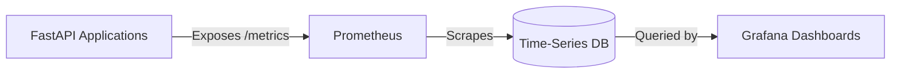

# Observability & Monitoring

MLForge achieves high observability through a pull-based metrics pipeline and structured logging.

## The Metrics Pipeline

### 1. Application Instrumentation
Every FastAPI service includes the `prometheus-fastapi-instrumentator` library. This automatically instruments HTTP middleware to track:
- `http_requests_total`
- `http_request_duration_seconds`

In addition, services expose custom application-specific metrics:
- **Prediction Service**: `redis_cache_hits_total`, `redis_cache_misses_total`, `prediction_latency_seconds`
- **Training Service**: `training_jobs_total`, `training_failures_total`

### 2. Prometheus
Prometheus runs in a dedicated container and aggressively scrapes the `/metrics` endpoint of every service every 5 seconds. It aggregates these data points into its internal time-series database.

### 3. Grafana
Grafana connects to Prometheus as a data source. We provide a pre-configured `mlforge-overview.json` dashboard that immediately renders:

- **API Traffic**: Requests per second (RPS) distributed by service.
- **Latency SLAs**: p95 and p99 HTTP response times to identify bottlenecks.
- **Cache Efficiency**: Real-time Redis cache hit/miss ratios.
- **Error Rates**: 4xx and 5xx HTTP status code anomalies.
- **Queue Health**: Training Job failures and Dead-Letter Queue (DLQ) depths.

## Structured Logging
Logs are printed in structured JSON format rather than plaintext. This enables log-aggregation platforms (like Elasticsearch or Datadog) to parse keys such as `request_id`, `service`, `level`, and `latency_ms` automatically, making querying significantly easier.
